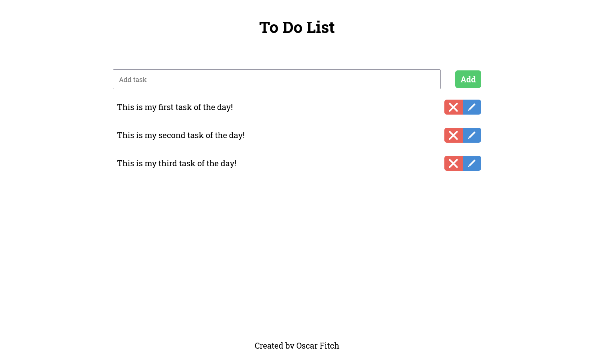

# 📝 To-Do List App

A simple and stylish To-Do List application built with **HTML**, **CSS**, and **JavaScript**. This is a beginner-friendly project focused on practicing DOM manipulation and responsive UI design.

---

## 🌟 Features

- ✅ Add new tasks
- 🗑️ Delete tasks
- ✏️ Edit tasks inline
- 💅 Styled with custom CSS and Google Fonts
- 🧠 Clean and organized code using event delegation

---

## 🚀 Demo

👉 [Live Demo on GitHub Pages](https://osivff.github.io/to-do-list/)  

---

## 🧰 Technologies Used

- HTML5
- CSS3 (Flexbox, Google Fonts)
- Vanilla JavaScript (DOM manipulation)

---

## 🎯 Goals of the Project

- Practice JavaScript event handling and DOM manipulation
- Improve CSS layout and styling techniques
- Build a small app from scratch with clean structure
- Gain confidence using Git and GitHub

---

## 🧠 Future Improvements

- [ ] Save tasks using `localStorage`
- [ ] Mark tasks as completed
- [ ] Filter tasks (All / Active / Completed)
- [ ] Make layout responsive on mobile devices
- [ ] Improve layout and styling

---

## 👨‍💻 Author

Created by **Oscar Fitch**  
[Github Here](https://github.com/osivff)

---

## 📄 License

This project is open source and available under the [MIT License](LICENSE).
